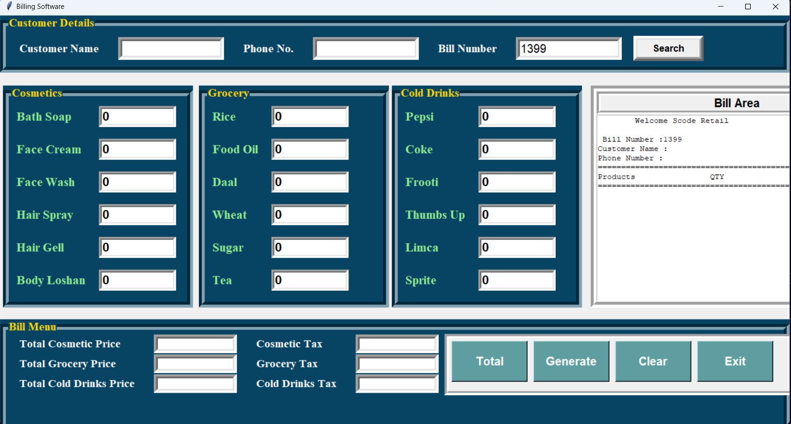

# Retail Billing Software 🛒💰


A comprehensive desktop billing application built with Python and Tkinter for retail businesses to manage sales, generate invoices, and calculate taxes automatically.





## Features ✨


- 📝 **Customer management** (Name, Phone, Bill No.)
  
- 🛍️ **Product categories**:
  
  - Cosmetics (Soap, Face Cream, etc.)
    
  - Grocery (Rice, Oil, Daal, etc.)
    
  - Cold Drinks (Pepsi, Coke, etc.)
    
- 🧮 **Automatic calculations**:
  
  - Product prices
    
  - Category-wise taxes (5% or 10%)
    
  - Grand total
    
- 💾 **Bill management**:
  
  - Save bills as text files
    
  - Search existing bills
    
  - Clear current transaction
    
- 🖨️ **Professional bill printing** format


## Installation ⚙️


### Prerequisites
- Python 3.x
- Tkinter (usually included with Python)

### Steps
1. Clone the repository or download the source code:
   ```bash
   git clone https://github.com/yourusername/retail-billing-software.git
   cd retail-billing-software

2. Navigate to the project directory:
   ```bash
   cd billing-software

3. Run the application:
   ```bash
   python billing_software.py


## Usage 🖱️


### Enter Customer Details:

- Fill in customer name and phone number

- Bill number auto-generates (editable)

### Add Products:

- Enter quantities for needed items

- Categories are clearly separated

### Generate Bill:

- Click "Total" to calculate amounts

- Click "Generate" to create the invoice

- System will prompt to save the bill

### Manage Bills:

- Search by bill number to retrieve old bills

- Clear button resets the current transaction


## Customization 🛠️


### To modify the software:

1. Change products:

   - Edit product lists in __init__ method

   - Update price calculations in total() method

2. Adjust taxes:

   ```python
   # Current tax rates
   self.c_tax = round((self.total_cosmetic_price*0.05),2)  # 5%
   self.g_tax = round((self.total_grocery_price*0.1),2)    # 10%

3. Change save location:
   ```python
   bills_dir = "D:\\billing software\\Bills"  # Modify this path


## Contributing 🤝


#### Contributions are welcome! Please:

1. Fork the repository

2. Create your feature branch

3. Commit your changes

4. Push to the branch

5. Open a pull request


## License 📜
- This project is licensed under the MIT License - see the LICENSE file for details.


## Support 💬
- For questions or issues, please open an issue on GitHub.
